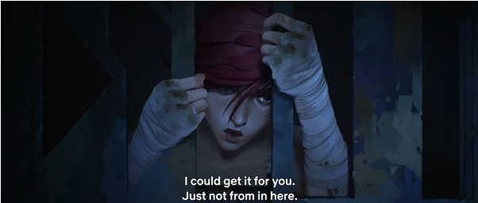
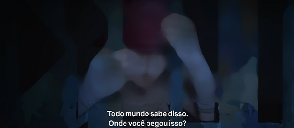
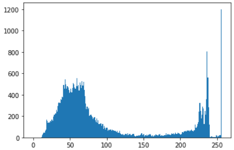
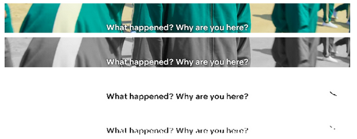
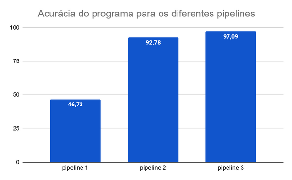

# RECONHECIMENTO DE TEXTO EM CENA APLICADO À EXTRAÇÃO LEGENDAS

Natan Duarte Procópio, Guilherme Lopes de Lima Souza

## RESUMO

Este trabalho tem como intenção aplicar o reconhecimento e processamento de imagens a fim de extrair legendas de vídeos com a utilização da ferramenta de extração de caracteres “Tesseract OCR”, demonstrando a capacidade didática dos alunos responsáveis pelo mesmo. Foram obtidas pelo menos 100 imagens - dentre elas, algumas estão em português, outras em inglês, e uma parte não tem legenda - a fim de demonstrar a eficiência do programa, bem como obter um amplo escopo de material para análise.

palavras-chave: extrair, legendas, processamento, OCR, análise.

# SCENE TEXT RECOGNITION APPLIED TO SUBTITLE EXTRACTION

## ABSTRACT

This essay intends to apply image recognition and processing in order to extract subtitles from videos, demonstrating the didactic ability of the students responsible for the project. At least 100 images were separated - among them, some are in Portuguese, others in English, and a part has no subtitles - in order to demonstrate the efficiency of the program, as well as to obtain a wide scope of material for analysis.

key-words: extract, subtitles, processing, OCR, analysis.

## 1 INTRODUÇÃO

O estudo da tradução de textos em vídeos, principalmente filmes e séries é de suma importância para os deficientes auditivos, tal qual para os profissionais que o fazem, uma ferramenta para facilitar a leitura, extração e tradução agilizaria esse processo de tradução, e o deficiente auditivo seria atendido mais rapidamente, segundo a ETC Filmes, levam-se 4 dias para terminar o processo de tradução de um longa-metragem de 90 minutos.
O processamento de imagens é versátil, confiável e preciso, sendo usado como aprendizado de máquina ou reconhecimento de padrões. A maioria das técnicas envolve o tratamento de imagens como sinais bidimensionais e a aplicação de padrões de processamento de sinal. Para este projeto, um software em python será desenvolvido a fim de capturar e processar as figuras, se sucederá a utilização de tratamentos que alteram o padrão de cor das imagens, bem como blur e equalização.

## 2 MATERIAS E MÉTODOS

Para este projeto, optamos por utilizar o Tesseract da Google, uma ferramenta de reconhecimento óptico de caracteres escrita em C + +. Ela será a responsável pela extração do texto na imagem, enquanto os autores serão responsáveis por uma solução de pré-processamento e segmentação adequadas. O Tesseract possui API 's para utilização em diversas linguagens de programação, sendo empregado nos mais diversos tipos de automações.

## 2.1 Pré-processamento

As imagens foram obtidas por meio de capturas de tela utilizando a ferramenta padrão do Windows 10 e 11. Foram capturados frames aleatórios dos minutos iniciais de séries e filmes legendados em português ou em inglês estadunidense. Além disso, em torno de dez por cento dessas imagens não possuem texto justamente para testar se a solução proposta consegue identificar tal ausência.

Figura 1. Exemplo de frame extraído da série Arcane

 

Fonte: Netflix, 2021.

A partir disso foi iniciado o pré-processamento. O primeiro passo foi renomear, via script, cada imagem do conjunto de dados. Em seguida, no mesmo script, foi aplicado um borramento leve em 80% da imagem, deixando nítido a região na qual as legendas ficam posicionadas. A ideia é evitar problemas com direitos de imagem. Essa relação 80/20 foi evidenciada por meio de testes empíricos. Também foi realizada uma padronização e redução no tamanho da imagem usando a interpolação em área visando uma perda menor de dados.

Figura 2. Exemplo de imagem redimensionada, 80% borrada

 

Fonte: Autores, 2022.

Outro passo importante foi criar uma linha de base para a nossa solução. Isso foi feito manualmente, associando o caminho de cada imagem a sua legenda em um arquivo JSON. Assim, podemos comparar a saída do modelo de extração com o texto real na imagem, quando existir.
Desse modo, obtivemos um conjunto de imagens devidamente padronizados e seguros. O próximo passo é garantir que o tesseract leia o texto corretamente, o primeiro passo para alcançar esse objetivo é uma segmentação adequada.

## 2.2 Segmentação

A partir desse ponto, o próximo passo foi consumir esses dados e iniciar uma análise exploratória. Baseado no script citado a pouco, foi extraído da imagem os 20% úteis, ou seja, a região no qual as legendas deveriam estar posicionadas. É nela que os esforços para realizar uma boa segmentação foram intensificados.
Com base nas análises de histograma, foi identificado um pico de luminosidade próximo do valor 255. Aplicando testes, percebeu-se que esse comportamento pertencia às legendas, as quais são naturalmente feitas para destacar-se do vídeo.

Figura 3. Exemplo de histograma obtido

Fonte: Autores, 2022

Tal informação foi utilizada como vantagem para a segmentação usando limiarização, conforme mostra a figura abaixo (em ordem, recorte de 20%, transformação da escala de cores para cinza, processo de binarização e borramento):

Figura 4. Processamento da imagem

 

Fonte: Autores, 2022

A estratégia de leitura escolhida para o tesseract comumente gera espaços em branco redundantes e quebras de linha que não existem. Nesse contexto, o uso de expressões regulares foi essencial para remover esses defeitos.

## 3 RESULTADOS

A extração de 20% da imagem, juntamente da expressão regular, foi excelente para filtrar a área de interesse, evitando possíveis textos extras que uma cena pode ter, bem como esquivando de possíveis “gafes”, como riscos em locais que não existem. Ao mudar a escala de cores para cinza, foi possível aplicar a binarização inversa, o que trouxe resultados impressionantes, extraindo o texto com uma grande exatidão.

Os primeiros resultados obtidos foram animadores, uma vez que, em grande maioria, a extração foi exata, tendo apenas algumas exceções. Dado às amostragens, foram alcançados padrões de erros que se repetem, e, dentre eles, a maior dificuldade se trata a respeito da letra “i” (em maiúsculo) que, na maioria das vezes, é confundido com "[" ou "l" (L, em minúsculo). Também foi descoberto que as letras "f, t, l," e “e, a, o” são normalmente trocadas entre si quando a extração é concluída.

A acurácia foi calculada utilizando um algoritmo simples de similaridade entre duas strings, comparando a saída da aplicação com o rótulo no arquivo JSON. Primeiro calculamos a acurácia da imagem com zero processamento (pipeline 1). Depois, calculamos a acurácia para a imagem a qual o borramento e a segmentação foram aplicados (pipeline 2). Também foi realizado um terceiro teste, aplicando a segmentação sem borramento (pipeline 3). O gráfico abaixo demonstra os resultados:

Figura 5. Acurácia do programa para os diferentes pipelines

 

Fonte: Autores, 2022

Depois de gerar a porcentagem de acurácia, percebe-se que a diferença da extração sem processamento (pipeline 1), para com as demais, foi avassaladora, sendo quase 50% menor. Ao comparar o pipeline 2 com o 3 foi notório que o padrão de erros presentes no pipeline 2 diminuiu quando o borramento foi excluído (pipeline 3), obtendo, assim, uma maior exatidão.

## REFERÊNCIAS

ETC Filmes. 6 INFORMAÇÕES ÚTEIS SOBRE TRADUÇÃO E LEGENDA. Disponível em: <https://etcfilmes.com.br/6-informacoes-uteis-sobre-traducao-e-legenda/>. Acesso em 01 de nov. de 2022.

How much percent this number is close to another. math.stackexchange.com. 17 de maio de 2017. Disponível em: <https://math.stackexchange.com/questions/2284623/how-much-percent-this-number-is-close-to-another>. Acesso em 26 out. de 2022.

Nanonets. How to OCR with Tesseract, OpenCV and Python. Disponível em: <https://nanonets.com/blog/ocr-with-tesseract/>. Acesso em 04 de nov. de 2022.

Pytesseract works incorrect with handwritten letters. stackoverflow.com. 2018. Disponível em: <https://stackoverflow.com/questions/69794265/pytesseract-works-incorrect-with-handwritten-letters>. Acesso em 04 nov. de 2022.

Pytesseract disable dictionary multiple configuration arguments. stackoverflow.com. 2018. Disponível em: <https://stackoverflow.com/questions/71566701/pytesseract-disable-dictionary-multiple-configuration-arguments>. Acesso em 04 nov. de 2022.

Drawing bounding boxes with pytesseract opencv. stackoverflow.com. 2018. Disponível em: <https://stackoverflow.com/questions/60009533/drawing-bounding-boxes-with-pytesseract-opencv>. Acesso em 04 nov. de 2022.

Python sort list of json by value. stackoverflow.com. 2018. Disponível em: <https://stackoverflow.com/questions/26924812/python-sort-list-of-json-by-value>. Acesso em 04 nov. de 2022.

Find the similarity metric between two strings. stackoverflow.com. 2018. Disponível em: <https://stackoverflow.com/questions/17388213/find-the-similarity-metric-between-two-strings>. Acesso em 04 nov. de 2022.
